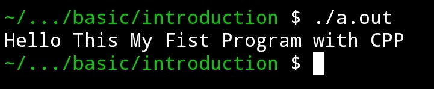

# CPP Beginner
basic c plus plus teaching materials
# General CPP Compiler preparation and installation
## Windows
1. Download Compiler 
## Mac
1. Download Compiler
## Linux
1. Download Compiler from Terminal
## Termux Android
1. Download Compiler from Termux <br>
   update your termux repositories

   ```
   pkg upgrade && update 

   ```
2. Download and Install Clang Package
   ```
   pkg install clang
   ```
3. Install Text Editor Nano Package
   ```
   pkg install nano
   ```
## Testing Compiler on Linux and Termux

 1. create a new file with name "main.cpp" <br>
   copy this batch command into termux command line
   ```
   nano main.cpp
   ```
   
  2. Enter this code and Save ctrl+x and Enter
   https://github.com/fajarjulyana/CPP-teaching-materials/blob/b030feb3fcea522b9bd626a7d92921cd0bbbe88c/basic/introduction/main.cpp#L1-L8
  3. Compile and Run
     ```
     clang++ main.cpp
     ```
     out default as "a.out"
     Run with command
     ```
     ./a.out
     ```
   4. output
   
